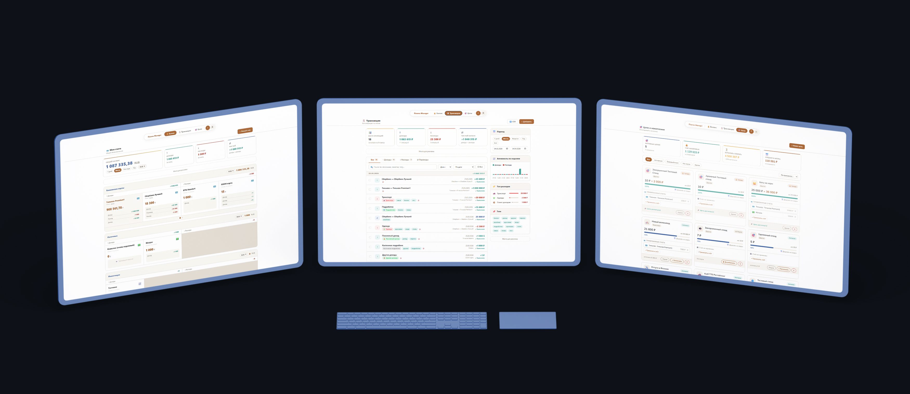
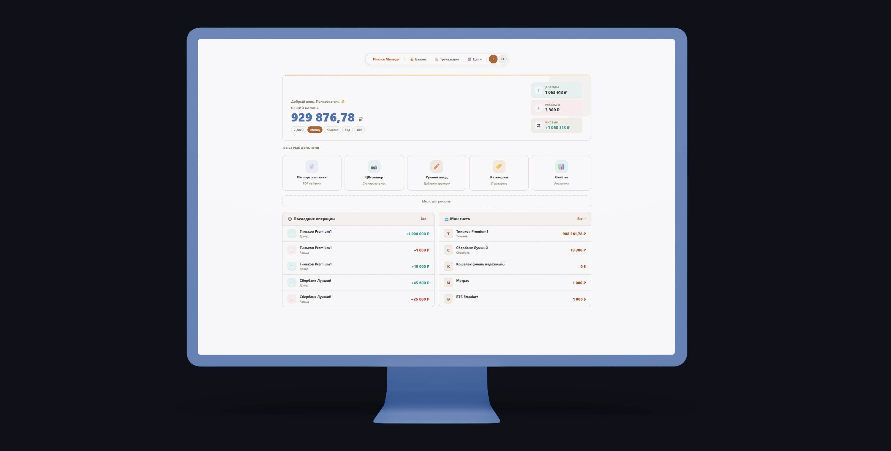

<div align="center">

# 💰 Finance Manager

**Кросс-платформенное приложение для учета личных финансов**

Единая кодовая база · Windows · Android · Web

[](https://dotnet.microsoft.com/)
[](https://learn.microsoft.com/dotnet/maui/)
[](https://blazor.net/)
[](https://postgresql.org/)
[]()

---



</div>

---

## Содержание

- [Функциональность](#функциональность)
- [Архитектура](#архитектура)
- [Технологии](#технологии)
- [Безопасность](#безопасность)
- [Нагрузочное тестирование](#нагрузочное-тестирование)
- [Внешние API](#внешние-api)
- [Roadmap](#roadmap)

---

## Функциональность

361 файл, 15+ модульных библиотек, 3 платформы, 1 разработчик.

- Учет счетов: карты, наличные, крипта, вклады, инвестиции, кредитные карты
- Мультивалютность с конвертацией в реальном времени
- Автопарсинг PDF выписок из 6 банков
- Перехват банковских уведомлений на Android
- QR-сканер чеков через ФНС
- Ручной ввод транзакций пакетами, поиск, фильтры, экспорт в CSV/PDF
- Цели накопления с привязкой нескольких счетов
- Дашборд с аналитикой по категориям и периодам
- Двухфакторная аутентификация
- Полная кастомизация



Демо: [учет транзакций](https://youtu.be/ZDPMEW8cTQc), [цели накопления](https://youtu.be/TFHmih1FxKs)

---

## Архитектура

**Хранение данных.** PostgreSQL для пользовательских данных, SQLite на устройстве для офлайн кеша, Redis как вспомогательный слой.

**Взаимодействие сервисов.** Backend и сервис разбора выписок общаются по gRPC с TLS. Разбор вынесен в отдельный процесс, чтобы нагрузка на парсинг не влияла на остальной API и масштабировалась независимо.

**Разбор выписок.** Сервис на Go принимает сырой текст из PDF, SMS или Push-уведомлений и проводит его через конвейер: нормализация текста, подбор парсера по уверенности совпадения, разбор метаданных и списка транзакций. Новый банк подключается Lua-скриптом без пересборки и без остановки сервиса. Дополнительно реализована поддержка пользовательских . 

```go
// Каждый парсер сообщает уверенность, что текст принадлежит именно ему
// Metadata и Transactions разбираются отдельно
type BankParser interface {
	TryMatch(text string) (confidence float64, ok bool)
	ParseMetadata(text string) (*Metadata, error)
	ParseTransactions(text string) ([]*Transaction, error)
} //BankParser

func Select(text string, parsers []BankParser) (BankParser, error) {
	var best BankParser
	var bestScore float64

	for _, p := range parsers {
		if score, ok := p.TryMatch(text); ok && score > bestScore {
			best, bestScore = p, score
		} //if
	} //for p

	if best == nil {
		return nil, fmt.Errorf("Парсер не найден")
	} //if
	return best, nil
} //Select

func ParseStatement(text string, parsers []BankParser) (*Result, error) {
	text = normalize(text)

	parser, err := Select(text, parsers)
	if err != nil {
		return nil, err
	} //if

	res := &Result{}

	// Metadata и Transactions - не блокируют друг друга
	if metadata, err := parser.ParseMetadata(text); err == nil {
		res.Metadata = metadata
	} else {
		res.MetadataError = err
	} //if

	if transactions, err := parser.ParseTransactions(text); err == nil {
		res.Transactions = transactions
	} else {
		res.TransactionsError = err
	} //if

	return res, nil
} //ParseStatement
```

**Логирование.** Каждый сервис пишет логи параллельно локально и в Kafka. При недоступности Kafka логи остаются локально и досылаются после восстановления соединения, без потери данных.

**Мониторинг.** Prometheus и Grafana для метрик, Jaeger для распределенной трассировки. Трассировка запроса между сервисами позволяет находить, на каком именно сервисе просела производительность, без ручного сопоставления логов.

**Точность вычислений.** Финансовые суммы хранятся в форме, исключающей ошибки округления IEEE 754. Конвертация валют спрятана за интерфейсом. Реализация ЦБ РФ упрощена в примере:

```csharp
public interface ICurrentConvertor {
    Task LoadRatesAsync(DateTime? date = null);
    EDecimal Convert(EDecimal amount, IsoCurrencyCode from, IsoCurrencyCode to);
    EDecimal SumInCurrency(IEnumerable<(EDecimal Amount, IsoCurrencyCode Currency)> amounts, IsoCurrencyCode target);
} //ICurrentConvertor

public class CbrConvertor(
    HttpClient? httpClient = null, 
    // Decimal128 по IEEE 754, максимум значащих цифр в промежуточных вычислениях
    int precision = 34) 
    : ICurrentConvertor 
{
    // HalfEven снижает накопление ошибки при массовом суммировании
    // Границы экспоненты -128..128 покрывают любые реальные суммы и курсы без потери точности
    private readonly EContext _ctx = new(precision, ERounding.HalfEven, -128, 128, false);

    // Курсы валют к рублю
    // Сам рубль всегда равен 1
    private readonly Dictionary<IsoCurrencyCode, EDecimal> _ratesToRub = [];
    private EDecimal GetRate(IsoCurrencyCode currency) =>
        _ratesToRub.TryGetValue(currency, out var rate)
            ? rate
            : throw new ArgumentException($"Курс для {currency} не найден");
    
    // Переводит сумму между двумя валютами через рубль
    public EDecimal Convert(EDecimal amount, IsoCurrencyCode from, IsoCurrencyCode to) {
        if (from == to) return amount;

        var amountInRub = amount.Multiply(GetRate(from), _ctx);
        return amountInRub.Divide(GetRate(to), _ctx);
    } //Convert

    // Переводит список сумм к выбранной валюте
    public EDecimal SumInCurrency(IEnumerable<(EDecimal Amount, IsoCurrencyCode Currency)> amounts, IsoCurrencyCode target) {
        var total = amounts.Aggregate(EDecimal.Zero, (sum, x) => 
            sum.Add(Convert(x.Amount, x.Currency, target), _ctx));

        // Без Reduce итог может быть в виде 0E-4 вместо 0
        return total.Reduce(_ctx);
    } //SumInCurrency
} //CbrConvertor
```

**FinanceManager.Secure.** Криптографические операции за единым фасадом, замена реализации не затрагивает вызывающий код.

---

## Технологии

.NET, MAUI Hybrid, Blazor Server, PostgreSQL, SQLite, парсинг PDF, Lua-скрипты для обработки выписок.

Полный стек: [tech-stack.md](tech-stack.md)

---

## Безопасность

- Многопроходное хеширование паролей
- Шифрование и подпись чувствительных данных
- Раздельная аутентификация для браузера и мобильного клиента
- Двухфакторная аутентификация через TOTP с резервными кодами

Подробнее: [security.md](security.md)

---

## Нагрузочное тестирование

Обычная нагрузка рабочего дня, резкий всплеск в разы выше расчетного пика, многочасовая непрерывная работа, отдельная проверка сервиса разбора выписок.

Подробнее: [testing.md](testing.md)

---

## Внешние API

| API | Назначение |
|---|---|
| ЦБ РФ | Курсы валют |
| CoinGecko v3 | Курсы популярных криптовалют |
| ФНС | Данные чека по QR-коду |

Запросы ограничены, ответы кешируются.

---

## Roadmap

| Функциональность | Статус |
|---|---|
| Учет счетов всех типов | ✅ |
| Мультивалютность и конвертация | ✅ |
| Автопарсинг PDF выписок | ✅ |
| Перехват банковских уведомлений (Android) | ✅ |
| QR-сканер чеков через ФНС | ✅ |
| Цели накопления | ✅ |
| Аналитика и дашборд | ✅ |
| Двухфакторная аутентификация | ✅ |
| Lua-скриптовый API | ✅ |
| Отчеты с графиками | ✅ |
| Экспорт в PDF/Excel | ✅ |
| Push-уведомления | ✅ |
| iOS | ❌ |
| Семейный доступ | ❌ |
| Панель для самозанятых и малого бизнеса | ❌ |

---

<div align="center">

[](https://t.me/so1operformance)
[](https://github.com/Juimun)

</div>
