# Нагрузочное тестирование

[← Назад к архитектуре](architecture.md)

Приложение прошло полный цикл нагрузочного тестирования: обычная нагрузка рабочего дня, резкий всплеск в несколько раз выше расчетного пика, многочасовая непрерывная работа и отдельная проверка внутреннего сервиса разбора банковских выписок.

Тесты проведены с помощью [k6](https://k6.io/) от небольшой нагрузки до нескольких тысяч одновременных активных актеров. Каждый тест охватывает все ключевые операции сразу: регистрация и вход в систему, работа с счетами, транзакциями и целями, получение и обработка данных из разных источников, а так-же работу сервиса парсинга и логирования.

---

## Реалистичная нагрузка

Имитация обычного рабочего дня: вход пользователей, запись операций по счетам, загрузка и сохранение банковских выписок одновременно, с учетом небольших пауз между действиями реального пользователя.

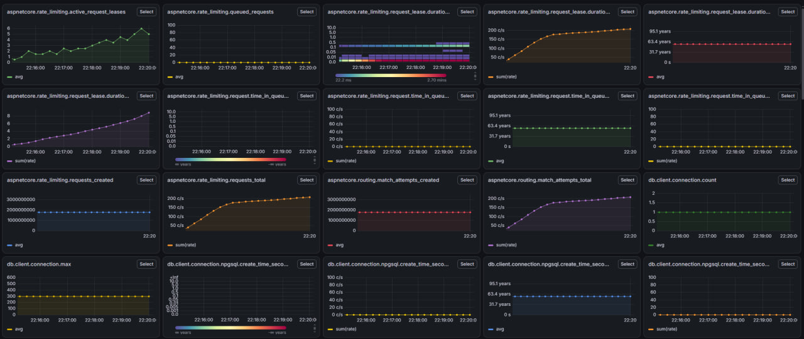
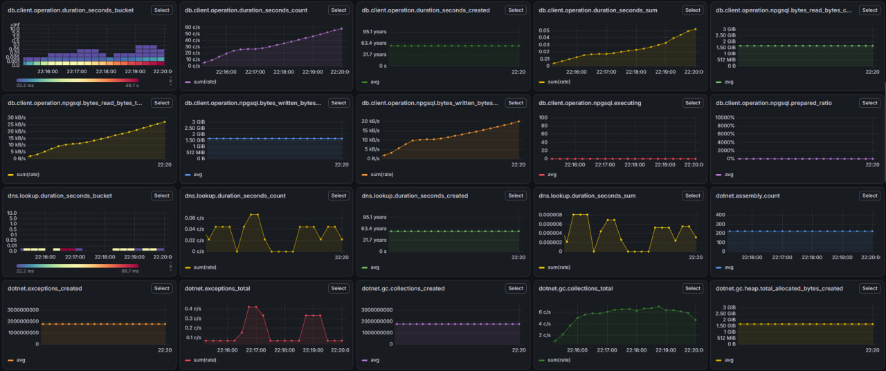
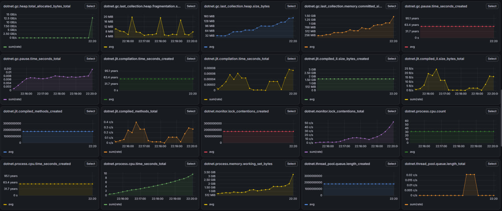
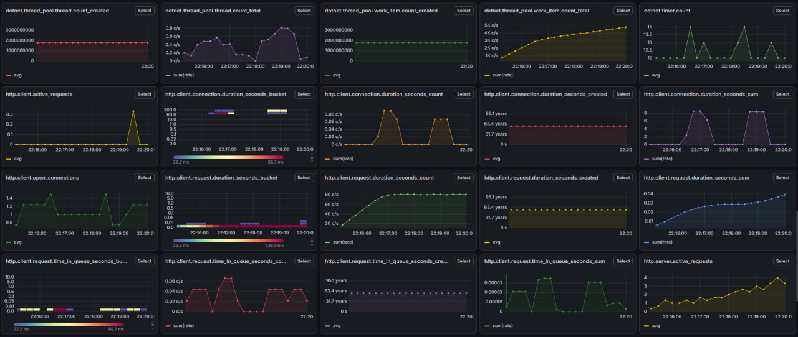
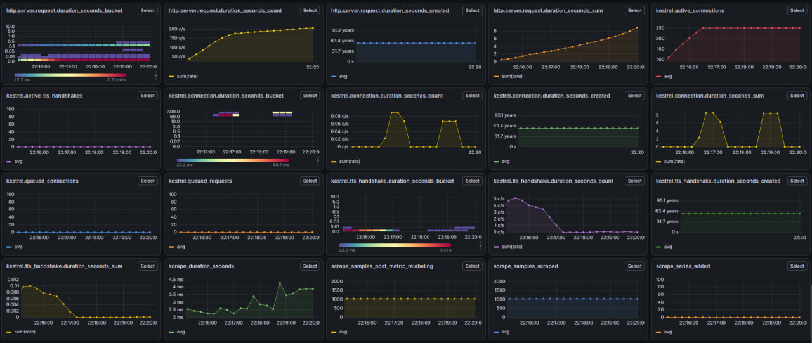
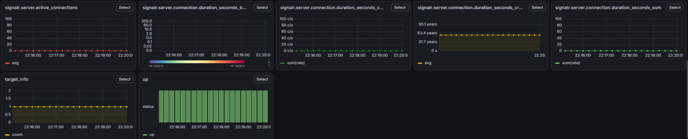

### Итог

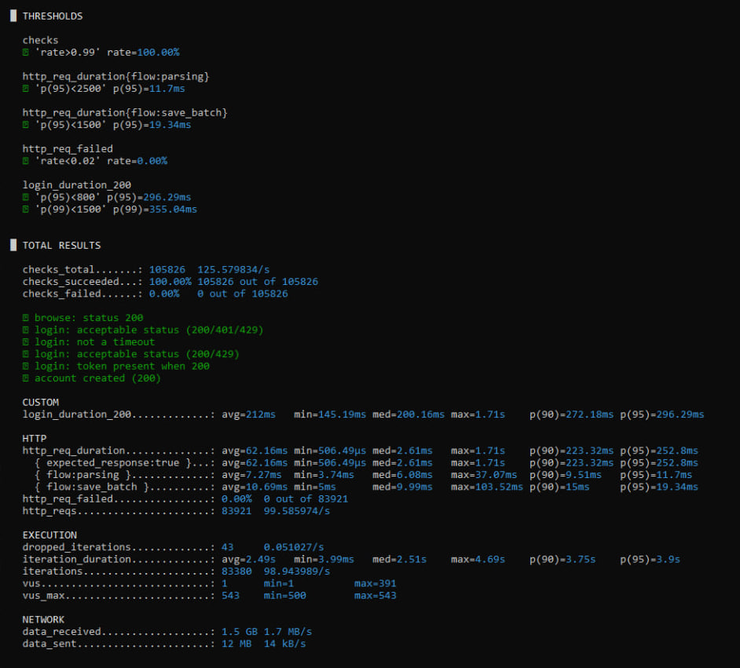

## Стрессовый всплеск

Резкий скачок нагрузки в несколько раз выше расчетного пика без плавного разгона, по всем направлениям одновременно, с проверкой восстановления системы после спада.

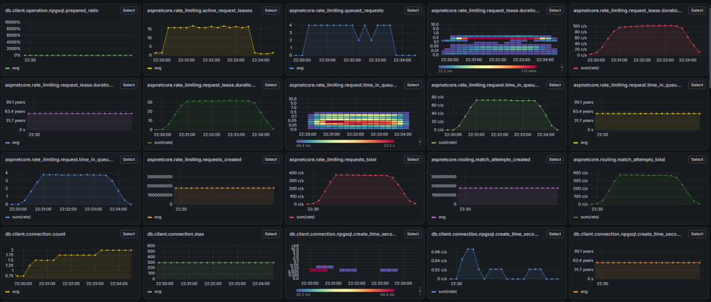
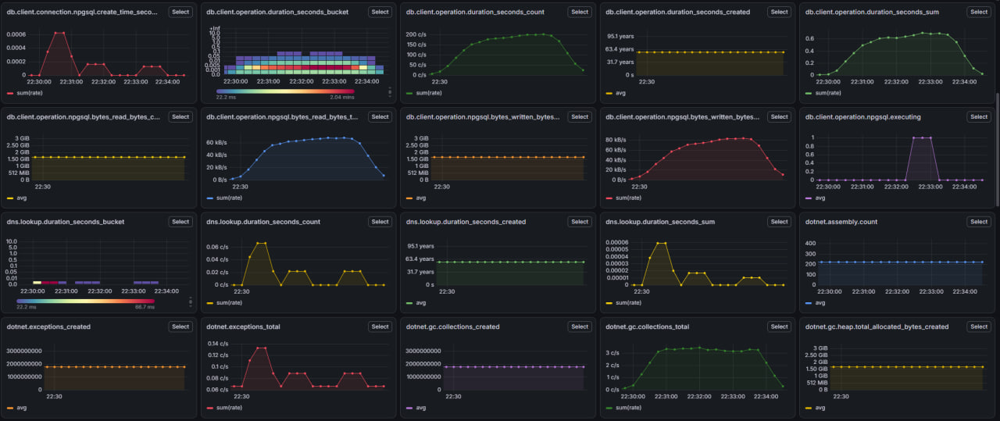
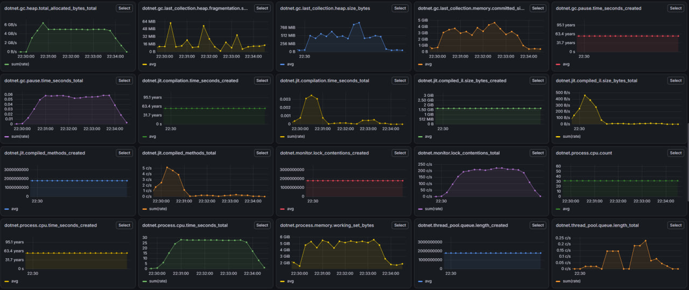
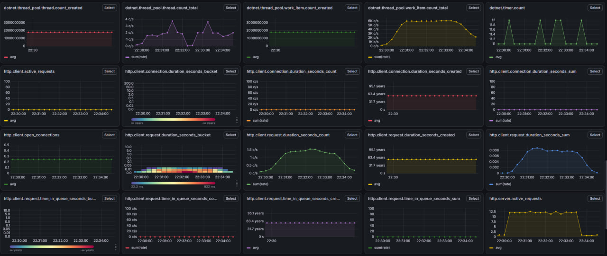
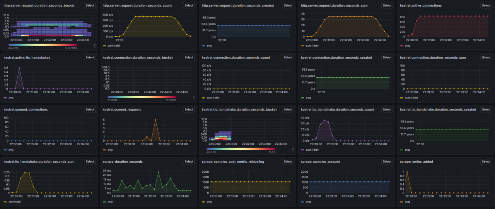
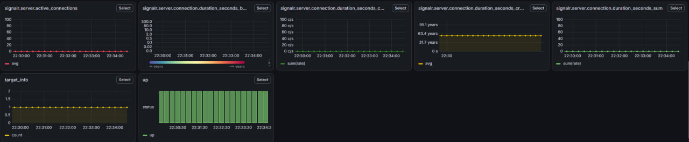

### Итог

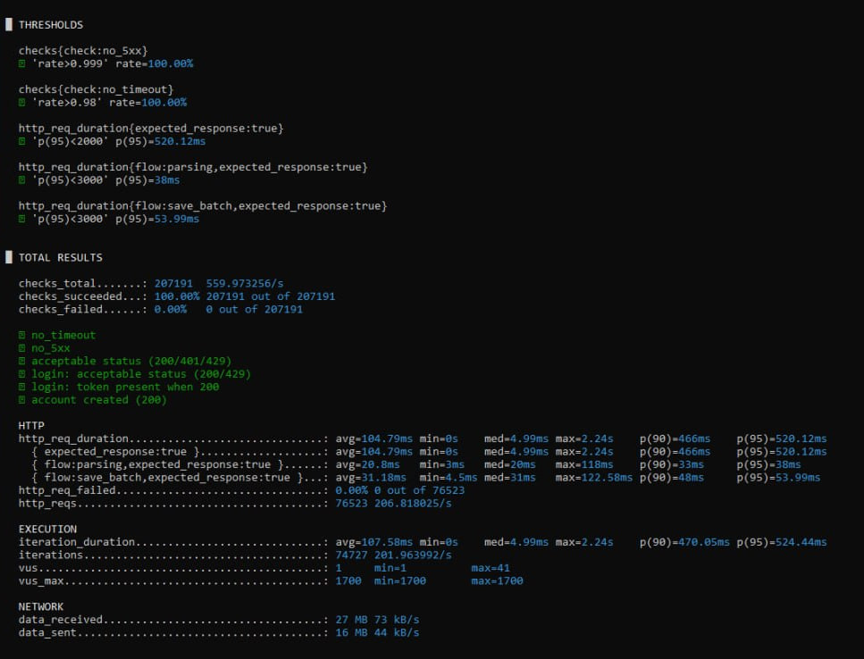

## Длительная нагрузка

Ровная нагрузка на расчетном уровне в течение нескольких часов. Цель теста не пиковые значения, а поиск проблем, которые проявляются только со временем: рост задержки ответа, утечки памяти, исчерпание соединений с базой данных.

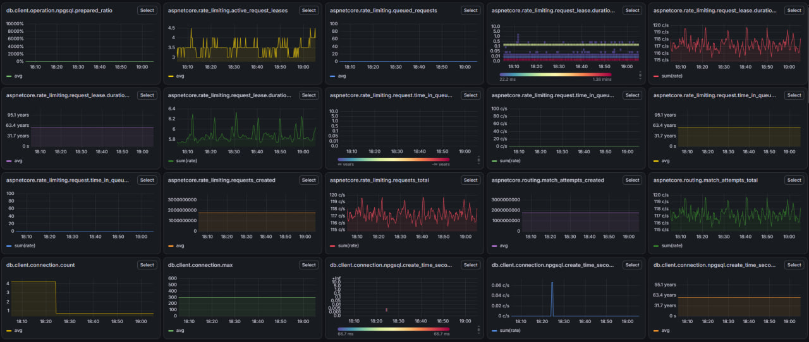
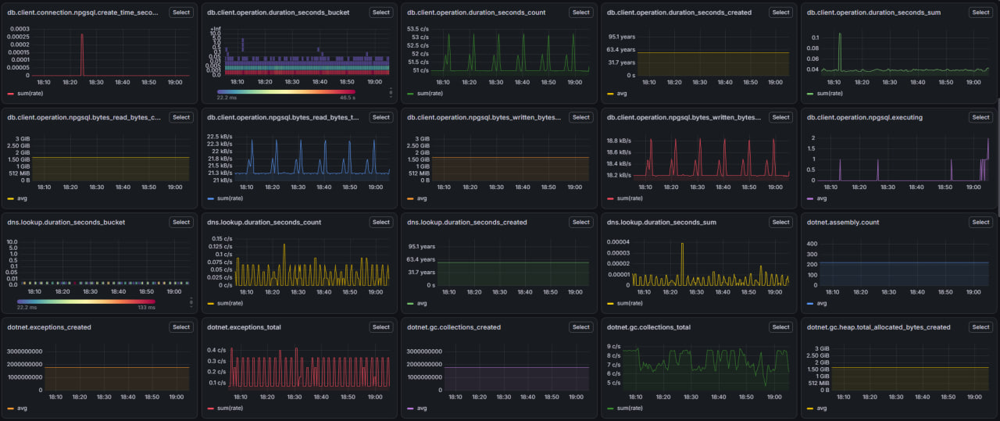
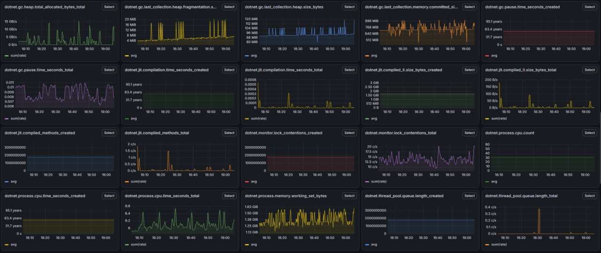
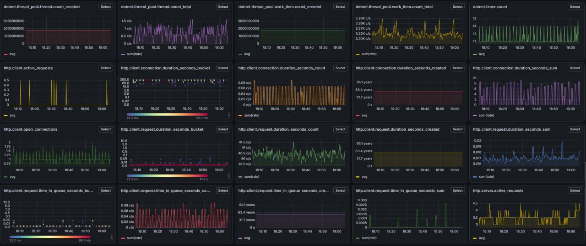
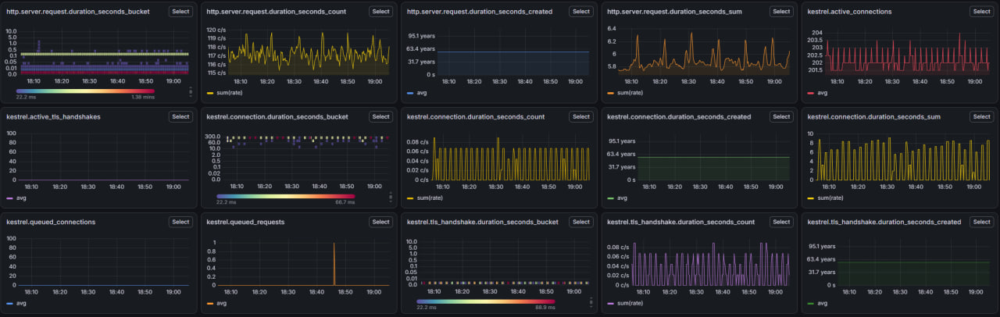
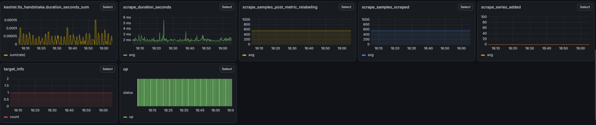

### Итог

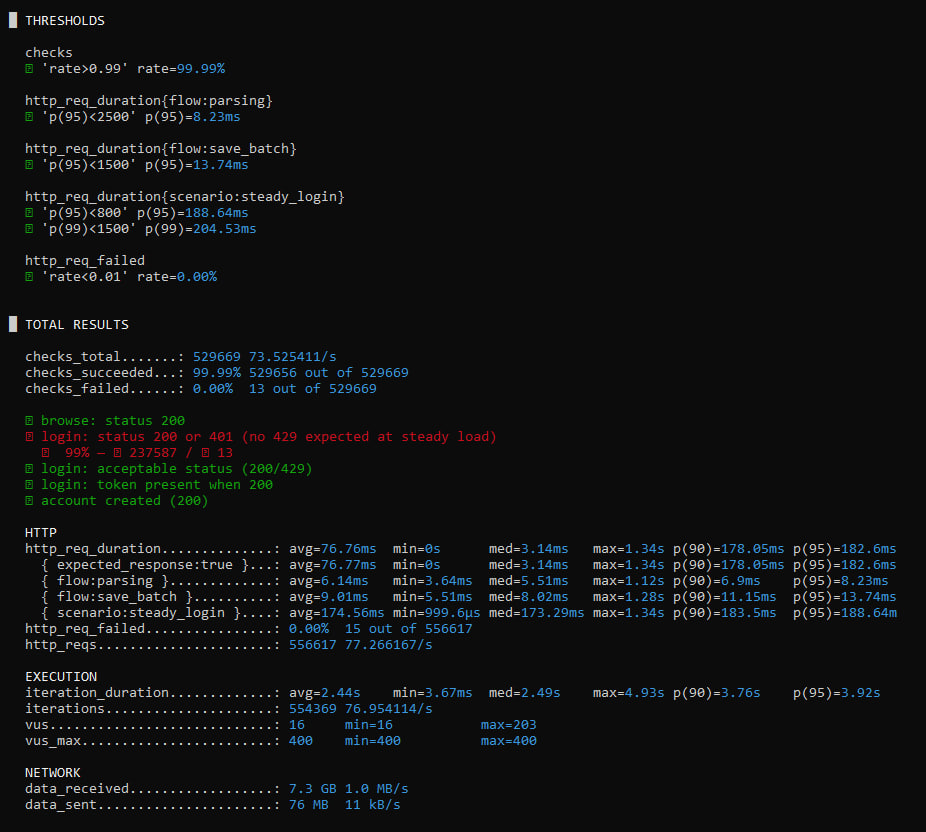

## Сервис разбора выписок

Отдельный внутренний сервис на Go, отвечающий за разбор текста банковских выписок через встроенный движок Lua скриптов, проверен напрямую по протоколу gRPC, в обход остальной части системы.

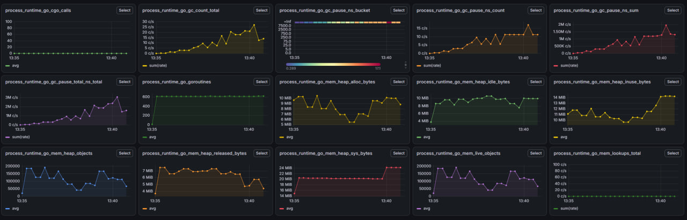

### Итог

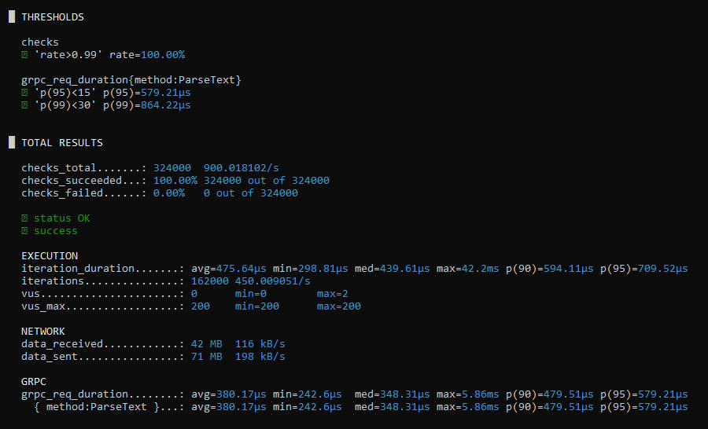

---

## Общий итог

Система устойчиво держит нагрузку в широком диапазоне: от небольшого количества пользователей до нескольких тысяч одновременных активных, как на ровном рабочем ритме, так и на резких всплесках, включая многочасовую непрерывную работу. Сервис разбора выписок показал запас производительности с большим отрывом от установленных порогов.

По итогам тестирования время ответа под пиковой нагрузкой заметно сократилось, устранено исчерпание соединений с базой данных, система стала предсказуемо отвечать отказом при перегрузке вместо долгого ожидания.